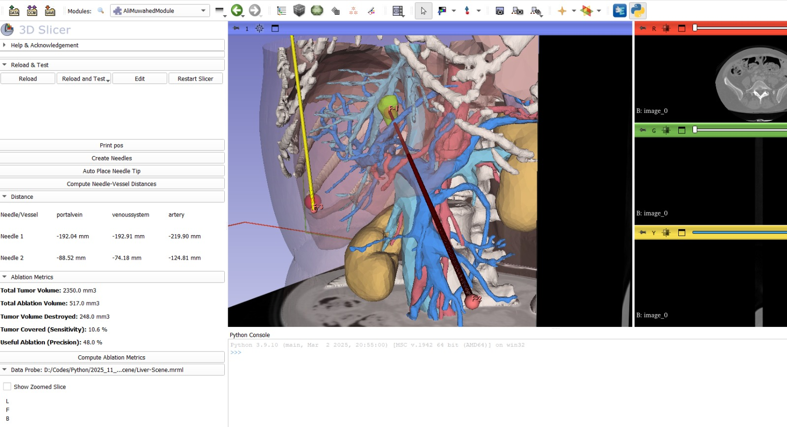
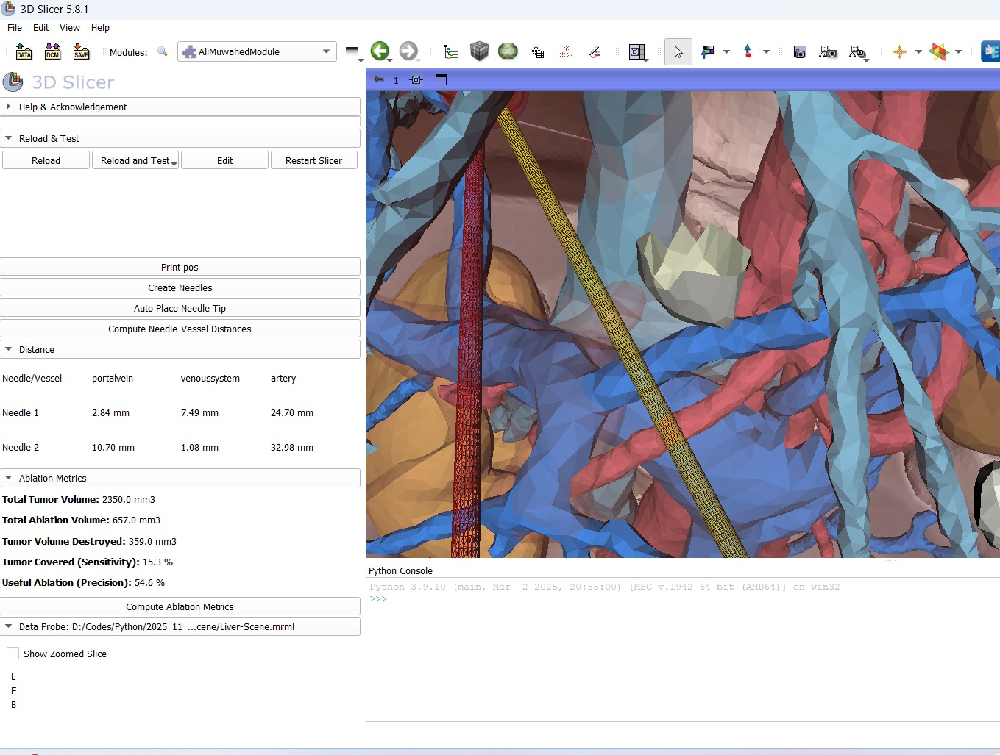

# liverNeedleModel

### Context
Thermal ablation is a surgical procedure used in the treatment of abdominal cancer to precisely destroy the tumors without needing open surgery. It involves implanting one or several needles through the skin to deliver extreme heat that will cause the necrosis of tumoral cells. 

This minimally invasive approach provides very good results with minimal invasiveness and allows for shorter hospital stays and recovery. Computer-assisted tools play a crucial role in planning and guiding the placement of these needles, ensuring safety and accuracy. Such technologies can optimize outcomes by reducing risks and improving the surgeon’s precision. Finding a good placement for the needles is a complicated task for the clinician, as the needles mustn't damage sensitive structures such as vessels, and shouldn't be too close to each other.

### Objective of the project
The objective of the project is to compute the risk associated to a set of candidate needles in the liver of a patient, as well as the volume of destroyed tissues. In this project, we will use the following simplified hypotheses:

* The **needles** are represented as cylinders between two points.
* The **risk** associated to a needle is represented by the distance from its cylinder to the vessels.
* The **volume of ablation** associated to a needle is represented as a sphere centered on a point located at 5mm from the tip of the needle.
* The **total volume ablated** is represented as the union of all the ablation spheres.

---

### Final Result

